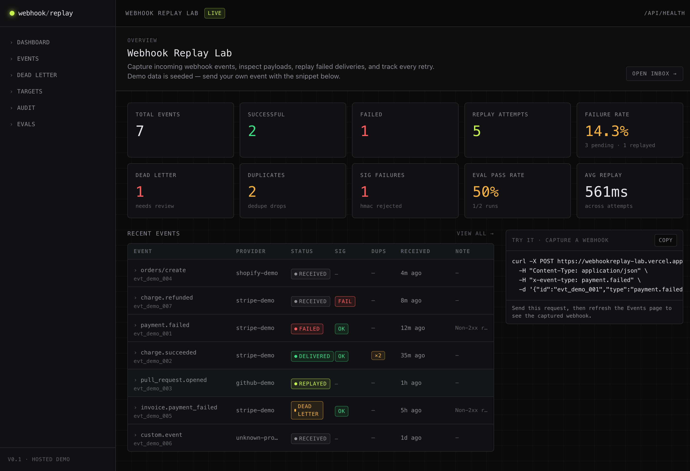
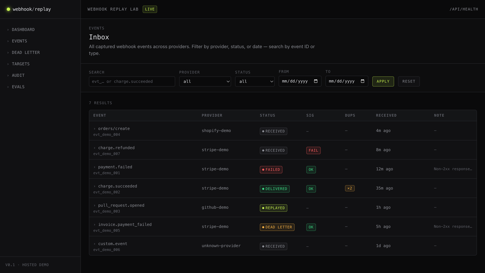
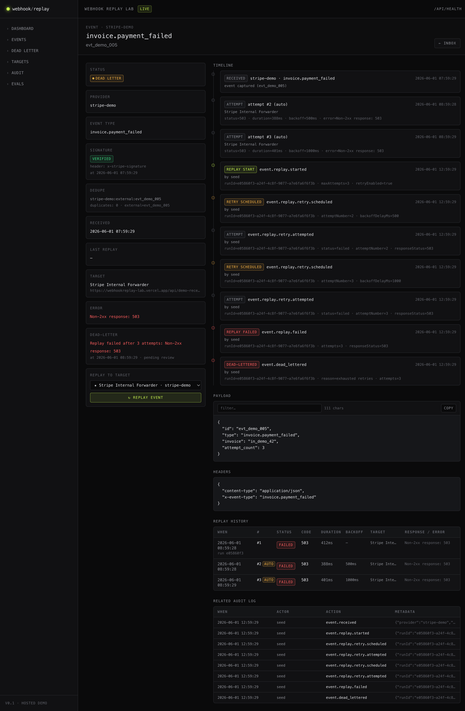
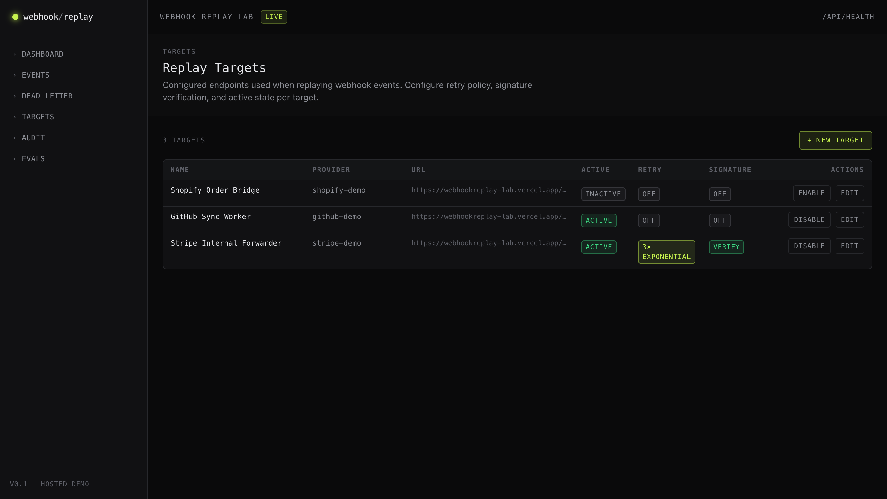
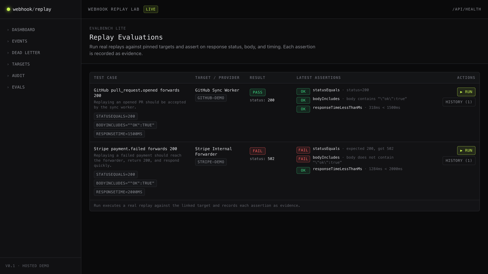
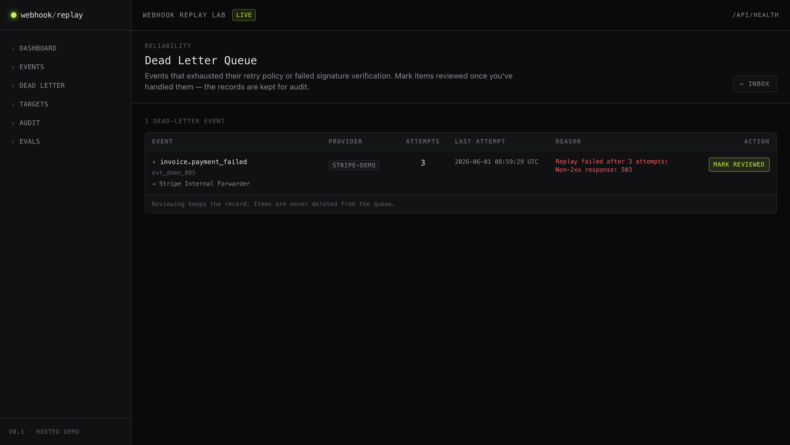

# Webhook Replay Lab

A full-stack developer tool for capturing webhook events, inspecting payloads,
replaying failed deliveries with retry/backoff, surfacing dead-letter events,
verifying signatures, deduplicating, and tracking reliability metrics.

**Live demo:** https://webhookreplay-lab.vercel.app/

## Screenshots

### Dashboard — totals, reliability metrics, recent events


### Events inbox — searchable, filterable webhook list


### Event detail — metadata, signature, dedupe, payload, replay timeline, audit


### Targets — replay endpoints with retry policy and signature config


### EvalBench Lite — assertion-based replay test cases with evidence


### Dead-letter queue — exhausted retries and rejected signatures


## What it does

- Captures any incoming webhook (POST `/api/webhooks/<provider>`) verbatim —
  headers, body, and resolved event type are stored.
- Verifies provider signatures (HMAC SHA-256, timing-safe) when configured
  on the matching target.
- Deduplicates events by `provider + externalEventId` (or canonical payload
  hash fallback) — duplicates increment a counter rather than creating new
  rows.
- Indexes events in a Postgres-backed inbox with provider/status/date filters.
- Replays stored events to a configured target URL without mutating the
  original payload, recording response status, body, duration, and error
  per attempt.
- Runs automatic retries with fixed or exponential backoff up to a per-target
  cap, then sends exhausted events to the **dead-letter queue**.
- Renders a per-event timeline (received → signed → deduped → replay
  attempts → dead-lettered → reviewed → eval).
- Lets you create, edit, enable, and disable replay targets directly from
  the Targets page (with retry policy and signature config controls).
- Records an audit log entry for every significant action, including retry
  scheduling, signature verification, dedupe detection, and dead-letter
  review.
- Surfaces an EvalBench Lite that pins an event + target to a list of
  assertions (`statusEquals`, `bodyIncludes`, `responseTimeLessThanMs`)
  and stores per-assertion evidence on each run.
- Ships a safe internal receiver at `/api/demo-receiver/<provider>` so
  replays work end-to-end without external services. It supports
  `forceFailure: true`, `forceStatus: <code>`, and `delayMs: <ms>` to
  simulate failure modes.

## Stack

- Next.js 14 (App Router)
- TypeScript + Tailwind CSS
- Postgres (Neon) + Prisma 5 with the `@prisma/adapter-neon` driver adapter
- Zod for validation (including discriminated-union assertions)
- Server components by default; client components only for interactivity

## Local setup

```bash
npm install
cp .env.example .env       # then edit DATABASE_URL
npx prisma migrate dev     # creates the schema
npx prisma db seed         # loads demo data
npm run dev                # http://localhost:3000
```

### Environment variables

| Var | Purpose |
| --- | --- |
| `DATABASE_URL` | Postgres connection string |
| `MIGRATION_TOKEN` | Required to call `/api/admin/migrate` and `/api/admin/seed` |
| `NEXT_PUBLIC_APP_URL` | Public URL for server-side link construction (optional) |
| `DEMO_RECEIVER_BASE_URL` | Optional override for the host used in seeded demo target URLs. Defaults to the deployed demo (`https://webhookreplay-lab.vercel.app`). Server-only on purpose — never inlined in the client bundle. Set to `http://localhost:3000` to reseed local targets at the local receiver. |
| `STRIPE_DEMO_SIGNING_SECRET` | HMAC secret for the seeded `stripe-demo` target. Only the env var **name** is stored in the DB; the value never leaves the server. |

A SQLite URL will not work — the schema uses Postgres-only `Json` columns
and enums.

Add additional `*_SIGNING_SECRET` env vars whenever you create a new target
that opts into signature verification. The target stores only the env-var
name (`signingSecretEnvVar`) and the expected header name
(`signatureHeaderName`).

### Database setup

```bash
npx prisma generate
npx prisma migrate dev   # local
npx prisma db seed       # local
```

### Seed command

`npx prisma db seed` (or `npm run db:seed`) is idempotent and loads:

- 3 replay targets, each pointing at the deployed demo receiver
  (`https://webhookreplay-lab.vercel.app/api/demo-receiver/<provider>`):
  - `stripe-demo` — retry enabled (3 attempts, exponential backoff,
    retries on 500/502/503/504) and signature verification enabled.
  - `github-demo` — no retries, no signature verification.
  - `shopify-demo` — fixed-delay retries, no signature verification.
- 7 webhook events covering: success, failed-pending-replay, replayed-ok,
  signature-verified, signature-failed, duplicate (`duplicateCount = 2`),
  and dead-lettered after retry exhaustion.
- 5 historical replay attempts including a 3-attempt retry chain grouped
  by `runId` with `attemptNumber`, `isAutomatic`, and `backoffDelayMs`.
- An audit log covering every M3 action.
- 2 eval test cases using assertion lists; eval runs persist
  `assertions[]` evidence (planned vs. actual per assertion).

## Retry policy

Retry policy lives on the target. Defaults are conservative — retries are
**off** unless explicitly enabled.

| Field | Bounds |
| --- | --- |
| `isRetryEnabled` | boolean (default `false`) |
| `maxAttempts` | 1 – 5 (default `1`) |
| `backoffStrategy` | `none` · `fixed` · `exponential` |
| `backoffBaseMs` | 100 – 10000 (default `1000`) |
| `timeoutMs` | 1000 – 30000 (default `15000`) |
| `retryOnStatuses` | array of HTTP status codes (e.g. `[500,502,503,504]`) |

Retry semantics:
- Each attempt creates a `ReplayAttempt` row with `runId`, `attemptNumber`,
  `isAutomatic`, `backoffDelayMs`, response status, body (capped 8KB),
  duration, and error.
- Network errors and timeouts always retry (subject to `maxAttempts`).
  Non-2xx responses retry only if their status is listed in
  `retryOnStatuses`.
- A 2xx response stops retries immediately and flips the parent event to
  `replayed`.
- After `maxAttempts` failures the event is flipped to `dead_letter` with
  `deadLetteredAt` and `deadLetterReason` set.
- Audit actions: `retry_policy_enabled`, `retry_policy_disabled`,
  `retry_policy_updated`, `event.replay.retry.scheduled`,
  `event.replay.retry.attempted`, `event.dead_lettered`.

## Dead-letter queue

`/dead-letter` lists every event with status `dead_letter`. An event lands
there when:

- it failed replay after `maxAttempts`,
- the target is missing/inactive/invalid at replay time, or
- signature verification rejected it (when verification is enabled).

The page shows the failure reason, attempt count, last replay timestamp,
target, and a deep link to the event detail. Click **mark reviewed** to
record `deadLetterReviewedAt` + `deadLetterReviewedBy = "demo-user"` and
write a `dead_letter_reviewed` audit log entry. Items are **never deleted** —
the queue is an append-only review surface.

## Event timeline

Each event detail page renders a unified timeline merging `AuditLog` rows
and `ReplayAttempt` retries. Kinds include `event.received`,
`signature.verified` / `signature.failed`, `duplicate.detected`,
`replay.started` / `replay.succeeded` / `replay.failed`,
`replay.retry.scheduled` / `replay.retry.attempted`, `event.dead_lettered`,
`dead_letter.reviewed`, `eval.run.started` / `eval.run.passed` /
`eval.run.failed`. Each row shows timestamp, label, status, short
description, and a metadata summary.

## Signature verification

Enable per target:

- `isSignatureVerificationEnabled`: boolean
- `signatureHeaderName`: e.g. `x-stripe-signature`
- `signatureAlgorithm`: `hmac-sha256`
- `signingSecretEnvVar`: env-var **name** holding the secret

The ingestion route reads the raw request body, computes HMAC SHA-256
using the env-var-resolved secret, and compares with `timingSafeEqual`.

Outcomes recorded on `WebhookEvent`:
- `signatureStatus`: `not_configured` · `verified` · `failed`
- `signatureHeaderName`, `signatureVerifiedAt`, `signatureFailureReason`

Failed signatures still create the event record (so it is visible in the
inbox and dead-letter queue) but no replay is attempted, and an audit
entry of `signature_verification_failed` is written. Verified events
audit `signature_verified`. The signing secret value is never logged,
returned by the API, or rendered in the UI — only the env-var name is.

## Deduplication

Every incoming event derives a `dedupeKey`:

1. `provider:externalEventId` if the payload includes a recognizable id
   (`id` or `event_id`), or
2. `provider:eventType:sha256(canonical(body))` as a fallback.

A unique index on `dedupeKey` enforces single storage. On collision the
existing row's `duplicateCount` is incremented and `lastSeenAt` is
updated; an audit entry of `duplicate_event_detected` is written and the
ingestion endpoint returns the existing event id with HTTP 200. The
event detail and inbox surface `duplicateCount` when greater than 0.

## EvalBench Lite (assertions)

Each `EvalTestCase` carries an `assertions` JSON array. Supported types:

- `statusEquals` — `{ type, expected: number }`
- `bodyIncludes` — `{ type, expected: string }`
- `responseTimeLessThanMs` — `{ type, expected: number }`

Backwards-compat fields (`expectedStatus`, `expectedBodyIncludes`,
`expectedMaxDurationMs`) are still accepted; the runner expands them into
the assertion list when `assertions` is empty.

`EvalRun.evidence` stores `{ assertions: [...], responseStatus,
responseBody, durationMs, replayStatus, replayRunId, attempts }` so the
UI can render planned-vs-actual per assertion. Final status is `pass`
only when every assertion passes. Audit actions: `eval.run.started`,
`eval.run.passed`, `eval.run.failed`.

## Test webhook command

```bash
curl -X POST https://webhookreplay-lab.vercel.app/api/webhooks/stripe-demo \
  -H "Content-Type: application/json" \
  -H "x-event-type: payment.failed" \
  -d '{"id":"evt_demo_001","type":"payment.failed","amount":4200,"customer":"cus_demo"}'
```

Returns `202 Accepted` (or `200 OK` for a duplicate, with the existing
event id). Refresh `/events` to see it.

To send a signed payload to the seeded `stripe-demo` target:

```bash
SECRET="$STRIPE_DEMO_SIGNING_SECRET"
BODY='{"id":"evt_demo_signed_001","type":"payment.succeeded"}'
SIG=$(printf '%s' "$BODY" | openssl dgst -sha256 -hmac "$SECRET" -hex | awk '{print $2}')
curl -X POST https://webhookreplay-lab.vercel.app/api/webhooks/stripe-demo \
  -H "Content-Type: application/json" \
  -H "x-stripe-signature: $SIG" \
  -d "$BODY"
```

## Replay behavior

- Replay clones the stored payload — the original is **never** mutated.
- Replay forwards to the event's stored `targetId`, falling back to the
  first active target for the same provider.
- Stored headers are forwarded (hop-by-hop headers stripped) and augmented
  with `x-replay`, `x-replay-event-id`, original-provider metadata, and any
  caller-supplied `headerOverrides`.
- A `ReplayAttempt` row is recorded for every attempt (manual or auto).
- The parent event's `status` flips to `replayed` on success, `failed` on
  failure (and `dead_letter` once retries are exhausted).
- All attempts in a single replay invocation share a `runId`, so the
  attempt history groups them visually.

Trigger a replay programmatically:

```bash
curl -X POST https://webhookreplay-lab.vercel.app/api/events/<event_id>/replay \
  -H "Content-Type: application/json" \
  -d '{}'
```

Optional body:

```json
{
  "targetId": "tgt_demo_stripe",
  "headerOverrides": { "x-trace-id": "manual-replay" }
}
```

## Demo receiver

```bash
curl -X POST https://webhookreplay-lab.vercel.app/api/demo-receiver/stripe \
  -H "Content-Type: application/json" \
  -d '{"hello":"world"}'
# 200 { ok: true, ... }

# Force a 500
curl -X POST https://webhookreplay-lab.vercel.app/api/demo-receiver/stripe \
  -H "Content-Type: application/json" \
  -d '{"forceFailure":true}'

# Force a specific status
curl -X POST https://webhookreplay-lab.vercel.app/api/demo-receiver/stripe \
  -H "Content-Type: application/json" \
  -d '{"forceStatus":429}'

# Add latency
curl -X POST https://webhookreplay-lab.vercel.app/api/demo-receiver/stripe \
  -H "Content-Type: application/json" \
  -d '{"delayMs":750}'
```

Seeded targets default to this receiver so replay works out of the box.

## Verification commands

```bash
npm install
npm run lint
npm run build
npx prisma generate
npx prisma migrate dev
npx prisma db seed
```

Manual checks against the deployed app:

```bash
# Health
curl https://webhookreplay-lab.vercel.app/api/health

# Capture an event
curl -X POST https://webhookreplay-lab.vercel.app/api/webhooks/stripe-demo \
  -H "Content-Type: application/json" \
  -H "x-event-type: payment.failed" \
  -d '{"id":"manual_test","type":"payment.failed"}'

# Capture the same event again — confirms dedupe (duplicateCount increments)
curl -X POST https://webhookreplay-lab.vercel.app/api/webhooks/stripe-demo \
  -H "Content-Type: application/json" \
  -H "x-event-type: payment.failed" \
  -d '{"id":"manual_test","type":"payment.failed"}'
```

Then in the UI:
- Open `/events/<id>` and confirm the timeline renders.
- Hit `/dead-letter` and click **mark reviewed** on a seeded item.
- Hit `/evals`, click **Run**, and inspect per-assertion evidence.

## Routes

| Path | Purpose |
| --- | --- |
| `/` | Dashboard — totals, reliability metrics, recent events |
| `/events` | Inbox — searchable, filterable event list (incl. `dead_letter`) |
| `/events/[id]` | Detail — metadata, signature, dedupe, payload, replay, timeline, audit |
| `/dead-letter` | Dead-letter queue with mark-reviewed action |
| `/targets` | Replay target list with retry/signature controls |
| `/audit` | Audit log |
| `/evals` | EvalBench Lite — run assertion-based test cases, view evidence |
| `POST /api/webhooks/[provider]` | Ingest a webhook (HMAC + dedupe) |
| `POST /api/events/[id]/replay` | Replay a stored event (body: `{ targetId?, headerOverrides? }`) |
| `GET /api/targets` · `POST /api/targets` | List / create targets |
| `GET/PATCH /api/targets/[id]` | Read / update a target |
| `POST /api/dead-letter/[id]/review` | Mark a dead-letter item reviewed |
| `POST /api/evals/[id]/run` | Run an eval test case |
| `POST /api/demo-receiver/[provider]` | Safe internal receiver for replays |
| `GET /api/health` | App + DB health |
| `POST /api/admin/migrate?token=…` | One-shot schema migration (Vercel-only) |
| `POST /api/admin/seed?token=…` | One-shot demo seed (Vercel-only) |

## Known limitations

- No authentication. Anyone with the URL can create targets and replay
  events. Admin endpoints (`/api/admin/*`) require `MIGRATION_TOKEN`.
- Targets cannot be deleted from the UI; disable them instead.
- Dead-letter items cannot be deleted — only marked reviewed.
- Retry counts are capped at 5; backoff is capped at 10s base; per-attempt
  timeouts are capped at 30s.
- Signature verification supports `hmac-sha256` only; the secret is read
  from an env var (no secret rotation UI).
- Dedupe falls back to a payload hash when no recognizable external id is
  present; payloads that are semantically identical but byte-different
  (different key order in non-canonical encodings) may not collide.
- EvalBench Lite assertions are limited to `statusEquals`, `bodyIncludes`,
  and `responseTimeLessThanMs` (no JSONPath yet).
- Per-attempt replay timeouts are bounded by `timeoutMs` (default 15s,
  max 30s).

## Deployment notes (Vercel + Neon)

- Schema migrations run via `POST /api/admin/migrate?token=<MIGRATION_TOKEN>`.
  Prisma's `migrate deploy` doesn't work through Neon's PgBouncer pooler, so
  the endpoint applies SQL directly via the Neon serverless `Pool`. The M3
  migration is idempotent — re-runs are safe.
- Seeding production also runs from Vercel:
  `POST /api/admin/seed?token=<MIGRATION_TOKEN>`. The seeder upserts by id
  so re-running does not create duplicates.
- The Prisma client uses the Neon driver adapter (`@prisma/adapter-neon`)
  with WebSocket transport (`ws`) so it works on Vercel's serverless runtime.
- Build runs `prisma generate` only (no migrations).
- Set `STRIPE_DEMO_SIGNING_SECRET` in Vercel project env vars before
  re-seeding so the seeded `stripe-demo` target can verify signatures.
- Deployment Protection must be configured to allow public access for the
  hosted demo.
